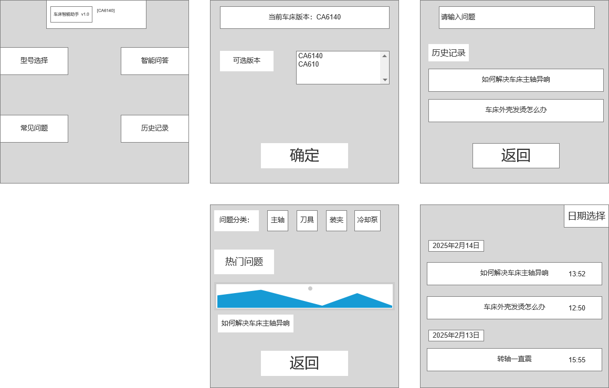
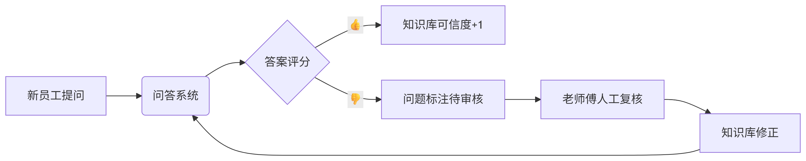

# 项目1：科技园车床智能问答

####      项目背景：

  校内实验室与科技园合作，构建一个基于车床操作手册的智能问答系统，结合LLM，langchain和prompt，优化知识库和检索过程，快速解决新员工对车床基础操作疑问，减少企业教学成本。

#### 产品概述：

- **工业用途**： 解决新员工对车床的基本认知，巩固培训知识，在操作过程中如遇基础问题或对某操作不确定时可通过**LLM**问答辅助解决，同时缓解老员工（培训师傅）教学工作量，专注于疑难问题。

- **使用范围**：针对手工车床CA6140主轴控制，螺纹加工，尾座控制等操作问题，后续可改进添加其他车床版本。

- **用户画像**：

  | 角色           | 痛点                         | 需求         |
  | -------------- | :--------------------------- | ------------ |
  | **新员工**     | 操作不熟练，不敢请教影响效率 | 实时交互     |
  | **骨干员工**   | 重复答疑，缺乏标准化教学     | 标准化答疑   |
  | **企业管理者** | 培训成本高，结果难量化       | 数据表格输出 |

####     需求分析：

- **数据调研**：

  1.新员工操作效率低下，70%不敢频繁询问师傅导致时间成本高；操作失误耗材量大；车床维修成本高。

  2.骨干员工普遍反映问题多重复性高，浪费时间精力导致加班不满。

- **竞品分析**：

  1.纸质查阅：效率低下，易沾染污泥识别不清，难以理解。

  2.传统FAQ：回答不智能，答非所问，成本较高。

  3.LLM问答：自然语言交互＋场景化引导，易迭代维护。

  #### 功能模块：

  1.**知识库构建**

  | 核心模块   | 业务价值           | 微调方法                  |
  | ---------- | ------------------ | ------------------------- |
  | PDF滑窗法  | 确保操作步骤连续性 | 窗口长度（window_size）等 |
  | 元数据管理 | 读取车床手册原文   | 标记分片来源（页码/章节） |

​       2.**检索增强**   

| 核心模块 | 业务价值                         | 微调方法                           |
| -------- | -------------------------------- | ---------------------------------- |
| 多路召回 | 增加车床术语库                   | BM25稀疏，M3E稠密                  |
| 混合检索 | 确定召回优先级，确保车床安全操作 | Faiss向量库；根据query类型调整权重 |
| 重排序   | 提升操作步骤类答案权重           | BGE-Reranker模型                   |

​        3.**问答生成**

| 核心模块   | 业务价值         | 模型选择                              |
| ---------- | ---------------- | ------------------------------------- |
| query优化  | 处理口语化问答   | qwen-7B,后续可在llama-factory框架微调 |
| 多模态模型 | 答案输出图文支持 | Llama3-V-2_5（开源）或RAG改造         |
| 保底机制   | 规避危险操作     | AC自动机结合DeBERTa-V3设置警告词      |

​       4.**推理优化**

采用vLLM模型框架，利用pageAttention和CUDA技术高效利用GPU资源，减少企业服务器资源成本，同时依靠continuous batching技术处理高并发场景，同时处理多个问题，提高回答速率。

​       5.**交互界面**

#### 数据流与闭环模块：

新员工每次提问都将给答案评分，定期检查知识库可信度，不断补充RAG知识库内容服务后续车床版本添加。

#### 非功能需求：

| 类型           | 具体条目                                     | 指标                                               |
| -------------- | -------------------------------------------- | -------------------------------------------------- |
| 性能           | 响应时间，离线缓存能力，                     | 首字延迟≤2s，支持TOP100条离线缓存问答              |
| 安全性         | 警告词设置，数据储存权限分级                 | 高危操作100%拦截，员工无法进行数据导出             |
| 兼容性         | 适配低安卓版本                               | 应用在车床显示屏或老旧平板                         |
| 工业环境适配   | 语音去噪与油污触碰                           | 交互界面简洁，文字增大，可在车床噪音下完成语音输入 |
| 数据与后续迭代 | 问答日志实时更新，定期导出表格，预留语音接口 | 量化培训成本，后续车床版本迭代，预留新服务接口     |

------

# 面试可能问到的问题

1.**介绍一下这个项目**

该项目构建了一个智能车床问答系统，目前针对CA6140型号搭建知识库，通过结合LLM,langchain与vLLM框架，回答员工操作问题。项目完整实现了RAG分片处理，混合检索，多路召回等操作，实现高效精准问答。

2.**做这个项目遇到哪些坑，如何解决的**  

有的，主要遇到两个问题，第一个问题就是员工输入query口语化，例如"光杠转不动咋整"，通过prompt对query做改写，优化输出完整内容："丝杠转动故障如何解决？"同时可以对术语缩写整理一个【缩写，中文全称】映射表，对输入做改写。这些优化显著提升了口语化，省略半截句召回效果。第二个问题是多员工并发测试吐字慢性能差。优化手段是可以采用vLLM框架来加速，合理调用GPU资源，采用多卡分布部署，更适配工厂弱网环境。

3.**这些架构部署都是你提出的吗？你主要工作是做什么**

这些架构主方向是实验室导师确定的，但部分技术选型和模型部署是由我提出的，例如我提出采用混合检索RAG，同时在稠密检索部分我测试了m3e的三种版本，最后选用了m3e-large，因为工厂主要确保高精度，以免造成设备损坏。同时在chat模型上我测试了deepseek-r1，qwen2，GPT-4o等，最后选择qwen2-7b（开源）作为备选生成引擎。同时我负责了2000条高质量测试集的构建，用户画像及需求分析，还有基本的交互界面设计。

4.**测试集是怎么构建的，讲一下过程**

首先我从操作手册里将问题分类，按照类别构建约600条问题并给每个问题都分类，但其中问题描述都非常术语话，导致检索匹配度不高，我通过商用通义千问来生成答案，人工对比答案质量，再将chatgpt-4o将600条问答泛化，规定将每一个问题输出为三个问题，要求口语化，东北方言化，输出为问答json格式，由此验证模型召回稳定性。最后进行人工筛选，保留2k条作为最终测试集。

5.**测试出的效果是怎么评估的**（m3e，chat模型，测试集生成）

作为生成类问题，我在评估方面主要考虑两个元素，一是答案关键信息，例如车床转轴操作模式，尾座顶尖松动，将答案关键信息作为关键词进行匹配和判断。第二个从语义上不能偏离标准答案太远，根据文本相似度来判断，整体采用两部分加权组合。

6.**提示词工程体现在你项目中哪些部分**

prompt主要体现在三部分，第一部分主要在测试集构建以及知识库检索，通过prompt我们将测试集打造为结合口语化，方言化，术语化。增强问答系统输入侧检索匹配。第二部分体现在系统输出侧，强制结构化输出，即步骤，安全标记，来源。例如对“主轴拆卸”问题，自动追加警告和手册章节。第三部分是知识库迭代，通过badcase分析动态更新提示词，同时根据回答满意度调整问答权重，定期更新。

